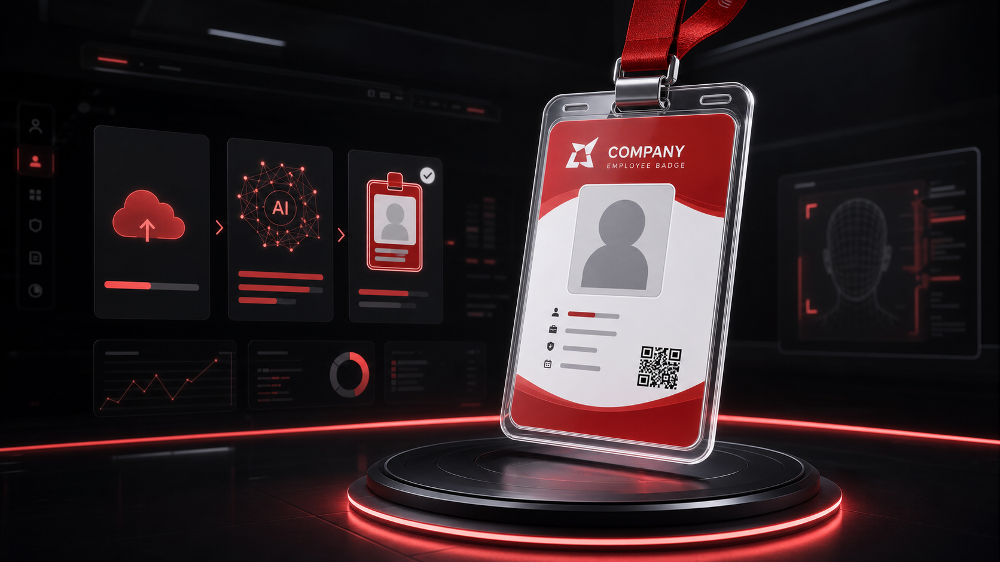
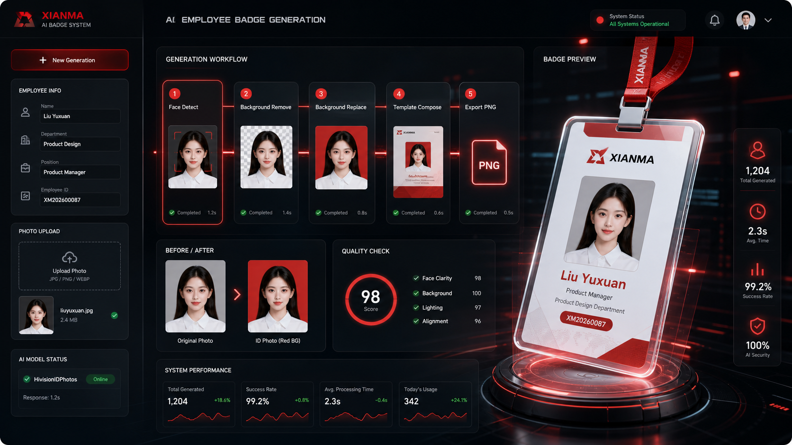
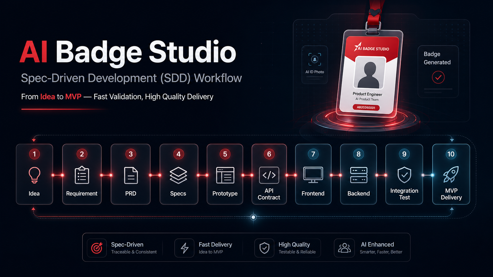

<div align="center">

# AI Badge Studio

### AI-SDD 规范驱动开发样例


**Idea → 需求澄清 → PRD → 规格沉淀 → 原型定稿 → 接口契约 → 前端交互 → 后端逻辑 → 前后联调 → 产品交付**

*遵循标准产研流程，独立完成从 Idea 到核心产品闭环的快速验证与高质量交付*

**简体中文** | [English](README.en.md)

</div>



## 项目简介

`ai-sdd` 是一个面向 AI 产品经理 / 独立开发者的 **SDD（Spec-Driven Development，规范驱动开发）样例仓库**。它不是只展示一个小工具，而是展示如何把一个模糊业务需求，沿着“需求澄清 → 原型定稿 → 前端交互 → 后端逻辑 → 前后联调”的标准产研流程，拆成 PRD、规格文档、接口契约、实现代码和测试验收等可追踪产物。

当前样例项目是 **AI 智能工牌生成系统**：员工上传生活照，系统自动生成统一风格证件照，并合成企业工牌 PNG。

核心流程不是简单生成一张图片，而是把证件照处理、工牌模板合成、字段校验和 PNG 导出串成一个可控工作流：

```text
员工照片上传
→ AI 证件照标准化
→ 工牌模板合成
→ 信息确认 / 质量检查
→ PNG 导出
```



上图展示的是产品工作台视角：左侧录入员工信息和上传照片，中间展示 AI 证件照处理链路，右侧预览最终工牌，并通过质量分、生成耗时、成功率等指标辅助验收。

## AI-SDD 规范驱动流程

```text
01 Idea
→ 02 需求澄清
→ 03 PRD 定义
→ 04 规格沉淀
→ 05 原型定稿
→ 06 接口契约
→ 07 前端交互
→ 08 后端逻辑
→ 09 前后联调
→ 10 产品交付
```



文档地图：

| 阶段 | 文档 |
| --- | --- |
| 产品定义 | [流程总览](docs/00-process-overview.md) · [需求澄清](docs/01-requirement-clarify.md) · [PRD](docs/02-prd.md) |
| 方案定稿 | [原型定稿](docs/03-prototype-freeze.md) · [接口契约](docs/04-api-contract.md) |
| 开发交付 | [后端逻辑](docs/05-backend-design.md) · [前后端联调](docs/06-integration-test.md) · [交付验收](docs/07-delivery-review.md) |

## 规格驱动结构

本仓库用 `specs/` + `changes/` 的方式组织产物，让需求不是停留在聊天记录或单份 PRD 里，而是沉淀成可验证、可迭代、可追踪的规格：

```text
openspec/
├── specs/      # 当前系统能力，作为 source of truth
└── changes/    # 本次 AI 工牌系统的变更包和交付记录
```

`specs/` 记录系统当前应该具备的能力，`changes/ai-badge-demo/` 记录从需求到实现的完整交付过程。后续新增“多模板切换”“批量生成”等功能时，也先进入 `changes/`，再同步到主规格。

## 规格迭代记录

| Change | 状态 | 说明 |
| --- | --- | --- |
| 核心闭环交付 | 已完成 | 跑通上传照片、证件照标准化、工牌合成和 PNG 导出基础闭环 |
| `support-multiple-templates` | 规划中 | 下一步支持企业选择不同工牌模板，降低定制成本 |
| `add-batch-generation` | 规划中 | 后续支持批量导入员工信息和照片，提高 HR 入职场景效率 |

## 核心功能

- **照片上传**：支持上传员工生活照或头像照片。
- **证件照标准化**：对接 HivisionIDPhotos，完成头像检测、裁剪、背景替换和证件照规格化。
- **工牌模板合成**：使用 HTML/CSS 工牌模板，将头像、姓名、部门、岗位、工号等信息动态写入。
- **PNG 导出**：后端通过浏览器渲染模板并输出最终工牌图片。
- **管理端预览**：提供 HR 风格的任务查看页面，用于展示生成记录和处理状态。

## 产品设计思路

这个项目重点展示三个产品判断：

- **可控性**：AI 负责重复性的图像标准化，人事字段仍然保留人工确认和修改空间。
- **一致性**：所有工牌输出遵循统一模板，避免不同员工照片风格差异过大。
- **流程适配**：产品定位是企业内部 HR / 行政提效工具，不是泛用图片生成玩具。

## 技术栈

- **前端**：React + Vite
- **后端**：Python HTTP service
- **图像处理**：HivisionIDPhotos API / Docker service
- **模板渲染**：HTML/CSS badge template + headless browser screenshot export

## 本地运行

### 1. 启动 HivisionIDPhotos

先在本地运行 HivisionIDPhotos，并确认 API 可访问：

```bash
curl http://localhost:8080/docs
```

### 2. 启动后端

```bash
cd xianma-badge
python3 server.py
```

默认后端地址：

```text
http://localhost:8888
```

### 3. 启动前端

```bash
cd xianma-badge/figma-make-export
npm install
npm run dev
```

然后打开终端里显示的 Vite 本地地址。

## API 示例

```bash
curl -X POST http://localhost:8888/api/generate \
  -F 'name=Demo User' \
  -F 'department=Product' \
  -F 'position=AI Product Manager' \
  -F 'employeeId=XM-2026-001' \
  -F 'photo=@/path/to/demo-photo.png'
```

返回字段：

```text
id_photo   标准化证件照 base64
badge_png  最终工牌 PNG base64
task_id    生成任务 ID
```

## 项目结构

```text
xianma-badge/
├── docs/                     # 标准产研流程文档
├── openspec/                 # 规格与变更包
├── figma-make-export/        # React 前端原型
├── server.py                 # 本地 API 服务
├── templates/                # 工牌 HTML/CSS 模板
├── assets/                   # 公开安全的视觉资源
└── README.md
```

## 隐私说明

仓库只保留匿名样例图片和测试数据，不提交真实员工照片、真实工牌、日志、上传文件或本地生成结果。
