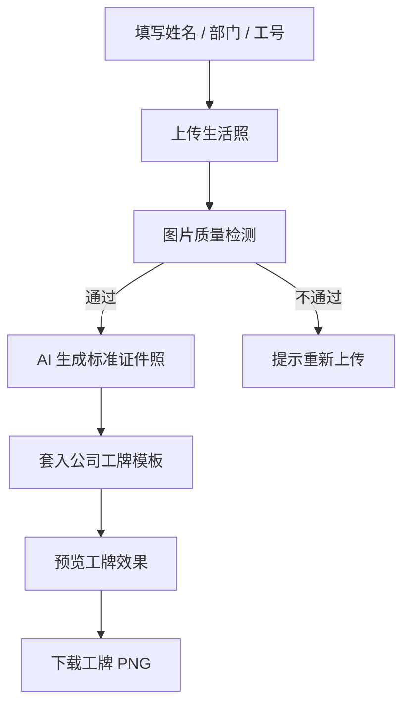
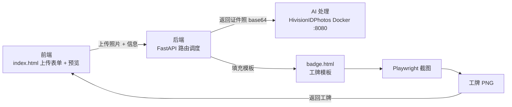

# 02 PRD

## 文档信息

| 项目 | 内容 |
| --- | --- |
| 产品名称 | AI 智能工牌生成系统 |
| 版本 | V2.1 |
| 文档类型 | 开源项目 PRD |
| 适用范围 | Demo 产品设计、需求评审、开发协作与交付验收 |
| 核心目标 | 员工上传生活照后，系统自动生成统一证件照，并套入公司工牌模板，输出可直接使用的工牌图片 |

## 1. 产品概述

### 1.1 背景与问题

企业员工入职、团队展示、工牌制作等场景，需要统一、清晰、风格一致的员工头像和工牌图片。当前如果依赖员工自拍或人工套图，会出现几个问题：

- 员工生活照质量不稳定，背景、光线、角度不统一。
- HR / 行政需要反复催收、审核、退回重拍，沟通成本高。
- 工牌模板人工套图容易出现姓名、部门、工号错位或漏填。
- 公司希望最终输出的工牌品牌风格统一、效果稳定、可直接使用。

### 1.2 产品定位

AI 智能工牌生成系统是一个面向企业内部的 AI 工牌生成工具：AI 负责头像标准化，模板系统负责品牌统一和稳定交付。

P0 阶段不做完整证件照 SaaS，而是先跑通核心闭环：

```text
生活照上传
→ AI 标准证件照
→ 公司工牌模板合成
→ 工牌 PNG 下载
```

### 1.3 目标用户

| 角色 | 核心诉求 |
| --- | --- |
| 员工 | 上传生活照，快速得到统一工牌图 |
| HR / 行政 | 减少催收、审核、手动套图和返工 |
| 设计 / IT | 维护工牌模板、品牌样式和导出规则 |

### 1.4 竞品与方案参考

竞品分析只保留和本作业相关的判断：

| 产品 / 方案 | 参考价值 |
| --- | --- |
| HivisionIDPhotos | 适合作为 P0 的证件照生成能力，负责人脸检测、抠图、背景替换、裁剪等 |
| 可立图 ClipImg | 代表商业 API 方案，后续可参考其证件照规格和合规检测能力 |
| BetterPic | 代表企业头像管理方向，说明 B 端团队头像 / 形象统一有实际需求 |

本产品的差异点不是单纯“生成证件照”，而是把证件照能力接到企业工牌生成流程里，直接输出公司可用的工牌图片。

## 2. 核心用户故事

### 2.1 主场景

员工需要制作公司工牌时，打开页面，填写姓名、部门、工号，上传一张生活照。系统自动生成标准头像，并套入公司工牌模板，最后输出一张可下载的工牌 PNG。

### 2.2 验收口径

| Given / When / Then | 内容 |
| --- | --- |
| Given | 员工需要制作公司工牌 |
| When | 员工上传生活照并填写基础信息 |
| Then | 系统在 15 秒内生成一张头像统一、模板布局一致的工牌 PNG |

## 3. 功能范围

### 3.1 P0 核心闭环



### 3.2 P0 必做功能

| 模块 | 说明 |
| --- | --- |
| 信息填写 | 姓名、部门、工号、职位等基础字段 |
| 生活照上传 | 支持 JPG / PNG，上传后做基础质量检测 |
| AI 证件照生成 | 调用 HivisionIDPhotos 或同类能力，完成抠图、背景替换、裁剪 |
| 工牌模板合成 | 使用 HTML / CSS 模板放入头像和员工信息 |
| 预览与下载 | 生成工牌预览图，支持下载 PNG |

### 3.3 异常处理

| 异常情况 | 处理方式 |
| --- | --- |
| 未检测到人脸 | 提示上传正面清晰人脸照片 |
| 检测到多人脸 | 提示只上传单人照片 |
| 人脸遮挡 / 侧脸明显 | 提示重新上传 |
| 照片模糊或过暗 | 提示更换清晰照片 |
| 工牌生成失败 | 支持重新生成 |

### 3.4 P1 / P2 扩展能力

| 阶段 | 能力 | 说明 |
| --- | --- | --- |
| P1 | HR 批量管理 | 批量邀请、审核、退回重拍、按部门导出 |
| P1 | 多规格输出 | 一次上传，同时生成工牌头像、一寸 / 二寸等规格 |
| P1 | 服装替换 | 将生活照服装统一替换为标准正装 |
| P2 | OA / HR 系统集成 | 对接钉钉、飞书、企微或 HR 系统 |
| P2 | 合规检测 | 增加证件照规格、相似度、活体检测等能力 |
| P2 | 私有化部署 | 支持企业数据不出内网，增加权限和审计 |

### 3.5 Non-goals

P0 阶段明确不做：

- 不做照片打印和物流。
- 不做证件办理 / 代办服务。
- 不做重度美颜，避免生成结果不像本人。
- 不做完整 HR 管理后台。
- 不承诺“100% 通过官方审核”。

## 4. 技术方案

### 4.1 P0 架构



### 4.2 组件方案

| 组件 | 方案 | 作用 |
| --- | --- | --- |
| 前端 | 单页 HTML | 上传照片、填写信息、预览工牌 |
| 后端 | Python FastAPI | 接收请求、调用 AI、渲染模板 |
| AI 处理 | HivisionIDPhotos | 证件照生成：人脸检测、抠图、背景替换、裁剪 |
| 工牌渲染 | HTML / CSS + Playwright | 将证件照和员工信息合成为 PNG |

选择 HTML / CSS + Playwright 的原因：模板修改直观、设计还原度高，比 Pillow 坐标拼图更适合快速迭代。

### 4.3 P0 不做的技术复杂度

P0 不需要数据库、对象存储、Nginx、Docker Compose、复杂权限系统。先用本地演示版跑通核心闭环，后续上线再补存储、权限、审计和批量任务。

## 5. 数据指标与验收标准

### 5.1 北极星指标

北极星指标：工牌生成成功率，即“上传生活照 → 下载工牌 PNG”的成功比例。

### 5.2 核心指标

| 指标 | 目标 |
| --- | --- |
| 工牌生成成功率 | >= 85% |
| 证件照生成成功率 | >= 85% |
| 工牌渲染成功率 | >= 95% |
| 模板一致性 | Logo、头像、姓名、部门、工号位置正确 |
| 端到端耗时 | P0 <= 15 秒 |

### 5.3 P0 验收标准

- 任意合格生活照可生成统一证件照。
- 头像不变形、不换脸，保留本人特征。
- 工牌模板风格统一，布局不跑版。
- 姓名、部门、工号等字段正确渲染。
- 输出 PNG 清晰，可用于展示或打印前预览。

## 6. 安全与风险

| 风险 | 应对方式 |
| --- | --- |
| 上传照片质量差 | 前置质量检测，不合格直接提示重传 |
| AI 生成结果不像本人 | 限制美颜强度，只做背景替换、裁剪和轻度优化 |
| 工牌信息错位 | 固定模板结构，渲染前校验必填字段 |
| 人脸数据敏感 | 明确用户授权，原图短期删除，不用于模型训练 |
| 企业数据安全 | P2 支持私有化部署和审计日志 |

## 7. 里程碑

| 阶段 | 时间 | 交付物 |
| --- | --- | --- |
| P0 作业交付 | 0.5 - 1 天 | 上传生活照 → AI 证件照 → 工牌合成 → PNG 下载 |
| P1 内部使用 | 2 - 4 周 | HR 批量邀请、审核、导出、多规格输出 |
| P2 企业级扩展 | 1 - 2 个月 | OA / HR 集成、合规检测、权限审计、私有化部署 |

## 8. 待确认问题

- 公司是否已有工牌 VI 规范？Logo、品牌色、字体是否可提供？
- 工牌需要哪些字段？姓名、部门、工号、职位、二维码是否都需要？
- P0 只需要本地演示，还是需要可在线访问的 Demo？
- 是否需要员工端下载，还是仅 HR / 行政下载？

## 9. 技术与产品参考

| 资料 | 链接 |
| --- | --- |
| HivisionIDPhotos 开源项目 | <https://github.com/Zeyi-Lin/HivisionIDPhotos> |
| 可立图证件照 API 文档 | <https://www.clipimg.com/wp/docs/idphoto_make/> |
| BetterPic 企业级 AI 头像 | <https://betterpic.io/> |
